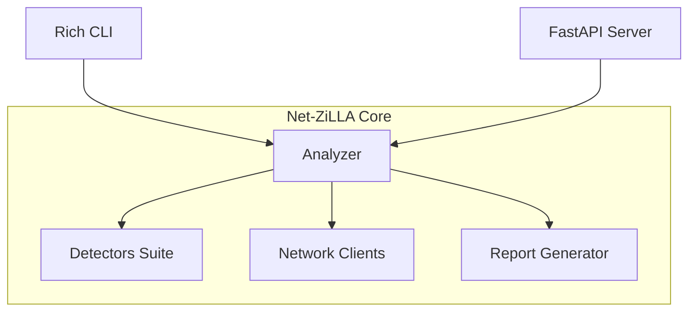

# 🦖 Net-ZiLLA

> ADVANCED THREAT INTELLIGENCE & DETECTION PLATFORM
> Modular Cybersecurity & Threat Intelligence Engine
> Powered by FJ™ Cybertronic Systems®
> Python 3.14+
> License: MIT

---

## Introduction

Net-ZiLLA is a modular Python cybersecurity framework for advanced threat intelligence analysis, deep URL parsing, domain reconnaissance, and multi-vector threat detection. It features a vintage MS-DOS CRT-style CLI, real-time ETAs, and a robust FastAPI backend. Net-ZiLLA is built for security analysts, automated pipelines, and SOC teams that require lightweight yet powerful threat correlation.

> [!TIP]
> Net-ZiLLA offers both a modern API and a retro-inspired CLI for versatile usage.

## Features

Net-ZiLLA provides comprehensive detection and analysis features, including:

- **Modular Detector Suite**: Pluggable, multi-vector threat detectors (phishing, malware, brand impersonation, SMS scams, URL shorteners).
- **Network Intelligence**: DNS client, WHOIS lookups, HTTP(S) request analysis, and Cloudflare threat intelligence integration.
- **Core Analysis Engines**: URL analysis, domain and content analyzers, data enrichment, and correlation.
- **Reporting**: Generates JSON-formatted analysis reports.
- **FastAPI Backend**: Exposes RESTful endpoints for automated and programmatic access.
- **Rich CLI**: Vintage CRT terminal interface with progress indicators and interactive controls.
- **Test Suite**: Pytest-powered tests for every core and detection component.
- **Configuration and Logging**: Flexible configuration and structured logging utilities.

> [!IMPORTANT]
> All major features are implemented as clearly separated Python modules under the `netzilla/` namespace.

## Requirements

- **Python**: 3.14 or later
- **Dependencies**: Managed via [pyproject.toml](pyproject.toml) and `uv` for virtual environment and package management

## Installation

To install Net-ZiLLA from source, follow these steps:

```steps
1. Clone the repository | Download and extract the source from GitHub.
2. Create a virtual environment | Use your preferred tool (such as `uv`).
3. Install dependencies | Run `uv sync` to install packages from pyproject.toml.
```

> [!NOTE]
> The project supports `uv` for dependency management and lockfile sync.

## Usage

Net-ZiLLA offers both CLI and API-based workflows.

### Command-Line Interface

Run analysis directly from the terminal using the CRT-style CLI.

```bash
python main.py <url>
```

- The CLI supports deep URL scans, domain reconnaissance, bulk analysis, and launching the API server interface.
- Navigate through an interactive menu with options for analysis, reports, and system logs.

### FastAPI Server

The API backend is implemented in `netzilla/api/server.py` and exposes several endpoints for automated analysis and health checks.

> [!TIP]
> Launch the API server from the CLI menu or directly through FastAPI-compatible tooling.

#### Example: Analyze a URL

##### Analyze URL Endpoint (POST /analyze/url)

### Analyze URL (POST /analyze/url)

```api
{
    "title": "Analyze URL",
    "description": "Analyze a single URL for phishing, malware, and threat indicators.",
    "method": "POST",
    "baseUrl": "http://127.0.0.1:8000",
    "endpoint": "/analyze/url",
    "headers": [
        {
            "key": "Content-Type",
            "value": "application/json",
            "required": true
        }
    ],
    "bodyType": "json",
    "requestBody": "{\n  \"url\": \"https://example.com\"\n}",
    "responses": {
        "200": {
            "description": "Analysis report JSON",
            "body": "{\n  \"result\": { /* threat analysis result */ }\n}"
        },
        "422": {
            "description": "Validation Error",
            "body": "{\n  \"detail\": [ /* error details */ ]\n}"
        }
    }
}
```

##### Health Check Endpoint (GET /health)

### Health Check (GET /health)

```api
{
    "title": "API Health Check",
    "description": "Check if the Net-ZiLLA API is operational.",
    "method": "GET",
    "baseUrl": "http://127.0.0.1:8000",
    "endpoint": "/health",
    "headers": [],
    "bodyType": "none",
    "responses": {
        "200": {
            "description": "Healthy",
            "body": "{\n  \"status\": \"ok\",\n  \"message\": \"API is healthy\"\n}"
        }
    }
}
```

> [!NOTE]
> Additional endpoints are defined in `netzilla/api/server.py` for batch analysis and SMS content analysis.

## License

MIT License.
See [LICENSE](LICENSE) for full terms.

## Configuration

- **Settings**: Located in `netzilla/utils/config.py`
- **Logging**: Structured logging provided by `netzilla/utils/logging.py`
- **Model Definitions**: All core data models and enumerations are defined in `netzilla/models/`

You may adjust logging and analysis parameters via the configuration module.

## Contributing

Contributions are welcome! Please follow these steps:

```steps
1. Fork the repository | Create your own copy on GitHub.
2. Create a feature branch | Work on your changes in a dedicated branch.
3. Add tests | Place tests in `netzilla/tests/` for new features or modules.
4. Ensure code style and tests pass | Use `uv run ruff check .` and `uv run pytest`.
5. Submit a pull request | Provide clear descriptions and reference relevant issues.
```

> [!WARNING]
> All code submissions must pass linting and automated CI tests (.github/workflows/ci.yml).

---

## Architecture

Net-ZiLLA is organized into functional modules:



> [!NOTE]
> All source files are under the `netzilla/` directory, grouped by function.

## Core Components

- **Detectors** (`netzilla/detectors/`): Implements base, phishing, malware, SMS scam, brand impersonation, and URL shortener detectors.
- **Network** (`netzilla/network/`): DNS, WHOIS, HTTP client, and Cloudflare intelligence modules.
- **Reports** (`netzilla/reports/generator.py`): Generates structured threat analysis reports.
- **Core** (`netzilla/core/`): Contains analyzer, content analyzer, correlation analyzer, data enrichment, and URL parsing logic.
- **CLI** (`netzilla/cli/app.py`): Rich terminal interface for user interaction.
- **API** (`netzilla/api/server.py`): FastAPI backend with request/response models.
- **Models** (`netzilla/models/`): Data models for DNS, threats, and analysis.
- **Utils** (`netzilla/utils/`): Configuration and logging helpers.
- **Tests** (`netzilla/tests/`): Comprehensive pytest suite for all modules.

> [!CAUTION]
> Make sure to review and test any new detector or module before deployment.

---

For further details, consult the documentation in [docs/index.html](docs/index.html) or explore the module docstrings and source files.

 ## FJ™ cybertronic Systems 
